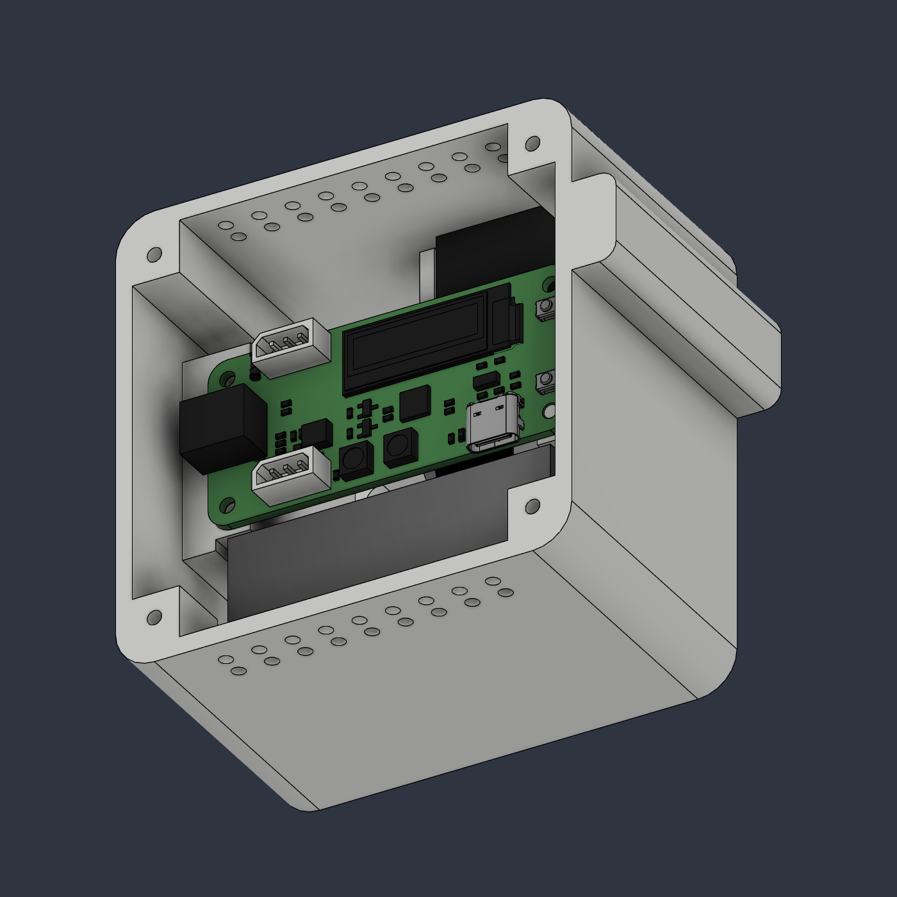

# Mechanical Switch

A compact, servo-driven mechanical switch enclosure with a Waveshare ESP32 servo driver and internal battery. The current design has a flat servo floor, lowered servo restraints, reinforced PCB support, a smaller rounded cable pocket, and a centred actuator window.

Updated **5 October 2026**. [Fusion and STEP files](3d/) · [Printable STLs](3d/stl/) · [Bill of materials](bom/BOM.md). Print one of each STL at 100% scale (millimetres). Prototype: physical fit and actuator completion remain to be verified.

