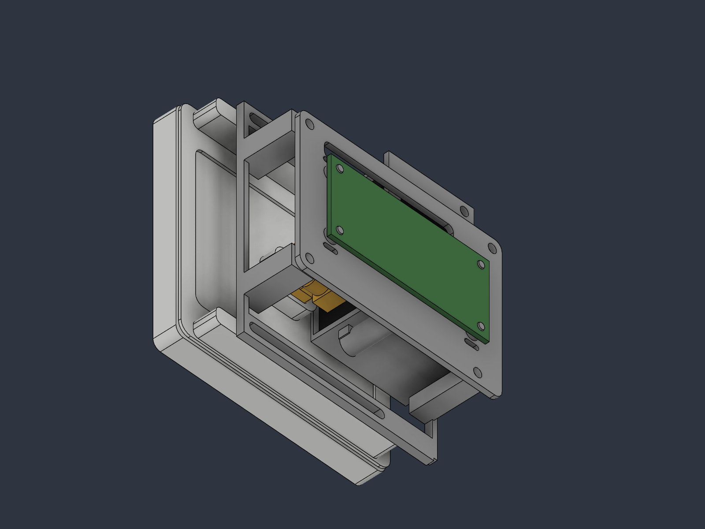
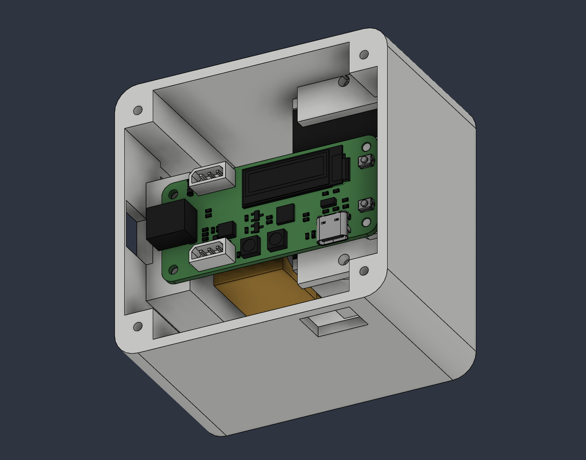

# IoT Beyond Lab — Mechanical Switch v0.6

The **Mechanical Switch** Fusion cloud document contains the saved v0.6 revision (2026-09-30). The live design is the source of truth.

The upper-right PCB tab obstructing the servo-wire escape is removed, leaving a continuous internal groove. The remaining lower-right support is aligned with the relocated board and joined continuously to its flange. Removing the filled space ahead of the servo allows the servo, stop, PCB, actuator and battery layout to move **4.8 mm toward the front wall** (+Y). The battery-side 1 mm exterior bump is removed from chassis and cover.

Overall enclosure envelope: **90 × 82 × 54.8 mm**, excluding adhesive and switch plate. The main enclosure remains 82 mm wide, with the existing 8 mm side cable pocket. Walls remain 3 mm nominal; the floor remains 3.2 mm.

**Documentation-only repository update:** CAD, STEP, STL, screenshots, scripts and JSON reports remain the **v0.4 baseline**. They do not represent v0.6 and must not be used to print this assembly. No revised 3D files were exported or uploaded; the revision is saved in Fusion only.

- [Mechanics](docs/mechanics.md) · [Assembly](docs/assembly.md) · [BOM](docs/bom.md)
- [Battery and wiring](docs/wiring.md) · [Printing status](docs/printing.md)
- [Validation and remaining checks](docs/validation.md) · [References](reference/README.md)

The actuator remains a placeholder. Its contact alignment with the fixed switch needs checking after relocation. The existing switch-rocker/chassis overlap remains unresolved. CAD checks are not physical fit or print validation.

## Historical v0.4 exports

[CAD and STEP](cad) · [STLs](stl). These images also show v0.4.

The historical export script is not part of this revision's workflow; it modifies geometry and overwrites v0.4-named files.
