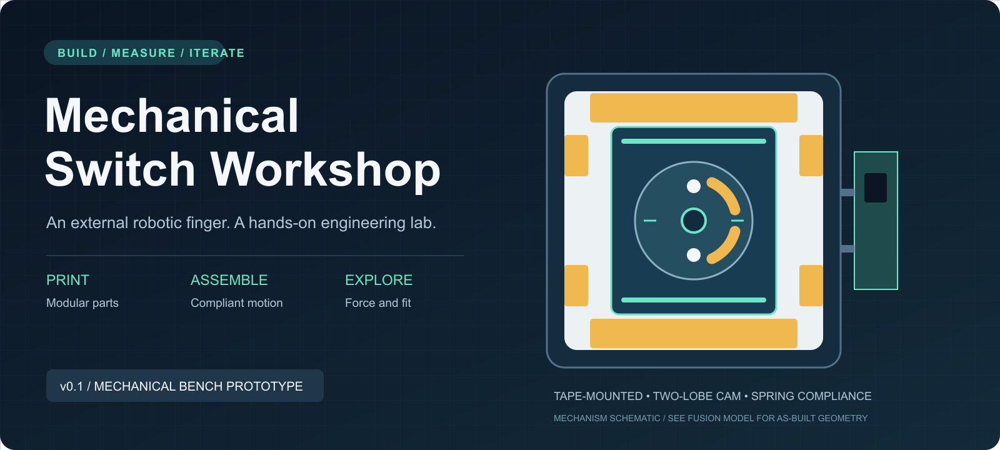
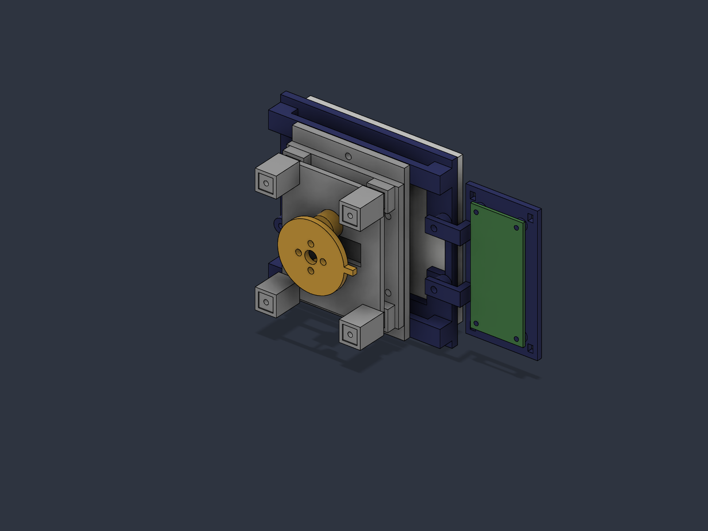

# Mechanical Switch Workshop

**Print a mechanism. Assemble a robot. Explore what makes a switch click.**

A hands-on mechanical engineering workshop built around a removable external actuator for 86–87 mm wall-switch faceplates. A bus servo turns a two-lobe face cam; compliant plungers press either end of the original rocker, then release it.

**v0.1 · Mechanical bench prototype · Autodesk Fusion · PETG + TPU**

[Start the workshop](docs/workshop.md) · [Print & assemble](docs/assembly.md) · [Parts & hardware](docs/bom.md) · [Design decisions](docs/mechanics.md) · [Validation](docs/validation.md)

> **Build status:** CAD and print meshes are available. This design has not been physically printed, fitted, load-tested, or powered. Start with the fit gauge and manual tests. The servo interface and spring selection are measurement gates before powered use.

## The first iteration

| Feature | v0.1 implementation |
|---|---|
| Mounting | Tape on the **plastic faceplate only**; no wall bonding or faceplate screws |
| Adhesive lands | Two 70 × 10 mm strips + four 8 × 14 mm strips; **1,848 mm² nominal** |
| Adjustment | 57 mm horizontal travel; ±12 mm vertical trim, locked with M3 bolts and nuts |
| Mechanism | 38 mm face cam, 4 mm lift, 22 mm plunger spacing |
| Compliance | Separate cam follower cups and contact stems; force passes through compression springs |
| Electronics | STS3215 reference envelope and an accessible Waveshare controller tray |
| Fabrication | 25 individual STL files, including duplicates and the pilot-hole coupon |
| Editable source | Named solid bodies in a native Fusion archive, plus a reproducible Python builder |

*Actual CAD view. Servo, PCB, faceplate and tape bodies are simplified references, not supplied components. Screws and springs are specified in the BOM rather than modeled.*

<strong>Look inside the mechanism</strong>

The gold cam drives two separate spring cups. The cradle is hidden in this view to expose the mechanism.

## Download and build

1. Open [Mechanical_Switch_v01.f3d](cad/Mechanical_Switch_v01.f3d) in Fusion, or browse the [STL folder](stl).
2. Read the [measurement gates](docs/validation.md). Record your switch, horn and spring measurements.
3. Print the pilot coupon, bezel and bridge first. Verify fit and adhesive contact before printing the full set.
4. Follow the [assembly guide](docs/assembly.md), then complete the manual plunger tests.
5. Progress to low-speed powered bench testing only after the mechanical checks pass.

**External actuation only:** installation does not require opening the faceplate, using its fixing screws, accessing mains wiring, or routing cables into the backbox. Use an unpowered training switch for the workshop.

## Learn by building

- Trace the load path from the switch, through the springs, cam, cradle and mounting tape.
- Compare clearance, backlash, friction and print orientation.
- Measure force and travel instead of assuming that a powerful servo is better.
- Test how adhesive area, offset loads and surface curvature affect attachment.
- Document a failed assumption and improve the next iteration.

The [workshop plan](docs/workshop.md) includes a practical session sequence and a measurement worksheet.

## What is verified?

The STL checks confirm closed edges and positive volume for all 25 meshes. Fusion checks inspect neutral solid overlap and nine sampled X/Y adjustment positions. These are geometric checks, not strength, motion, electrical or adhesion certification. See [the validation record](docs/validation.md) and [machine-readable results](validation).

## Repository map

| Folder | Contents |
|---|---|
| [`cad/`](cad) | Native Fusion file, builder, inspection and export scripts |
| [`stl/`](stl) | Individual print meshes in millimetres, translated to the origin |
| [`docs/`](docs) | Mechanical design, BOM, assembly, wiring, workshop and test gates |
| [`assets/`](assets) | Cover and actual Fusion views |
| [`validation/`](validation) | Geometry reports and repeatable STL checker |
| [`reference/`](reference) | Context summary and manufacturer references |

The source proposal was used as context and is not redistributed here. **The dimensions and limitations in `docs/` describe the delivered v0.1.** The proposed 18/26 mm inserts, compact enclosure and alternative sidecar mounts are future work.

