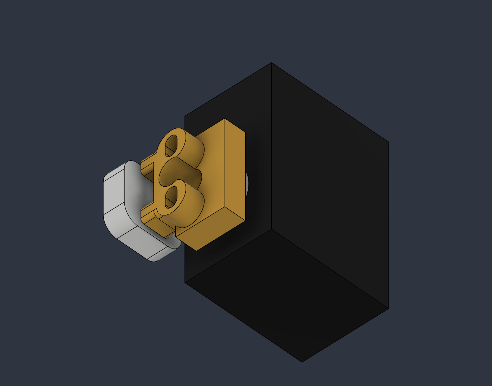

# Mechanical Switch — v0.3

A removable servo actuator for the small rounded rocker on a square wall-switch plate. **Prototype: physical force, travel and fit are still unverified.**

The live Fusion file has **nine named components / twelve solids**, including six printed pieces, the servo with its stock metal horn, the ESP32 driver and the reference switch board. Adhesive solids, screw placeholders, alternate inserts, test coupon and component keepout clutter have been removed. The cover is retained but hidden by default; turn on component 06 to inspect it.

The new **one-piece PETG rocking shoe** replaces the thin TPU leaves and their central screw attachment. A 6.2 mm horn web and broad 5 mm bridge take the load directly from the stock metal horn to two integral contact lands. No custom CNC part or printed spline is specified. Thin optional soft facing protects the switch surface; it is not a torque limiter.

[Fusion archive](cad/Mechanical_Switch_v03.f3d) · [STEP](cad/Mechanical_Switch_v03.step) · [Six print meshes](stl) · [Mechanical audit](docs/mechanics.md) · [Assembly](docs/assembly.md) · [BOM](docs/bom.md) · [Validation](docs/validation.md)

The 86 mm plate and 17 × 17 × 6 mm rocker remain dimensional assumptions. The related Schneider S-Classic family is a plausible visual reference, not a confirmed identification of the pictured switch. Measure the actual switch before printing the final shoe or powering it.

The retained mounting frame provides ±26 mm static horizontal adjustment. Tape and screws remain required physical hardware even though their reference solids are removed. Source scripts recreate the geometry; Git history retains v0.2.
